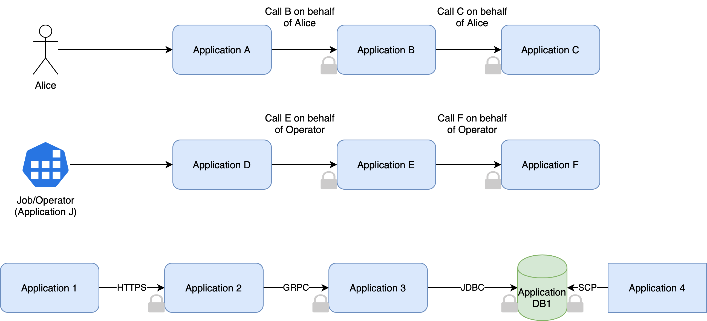

Navigation | [[Table Of Contents]](README.md#navigating-the-documentation)

# TrustFabric Specification Goals

Typical enterprise service interactions are very complex and diverse. Following diagram illustrates different interactions:

Some of the important observations that can be concluded from these interactions are:

    
1. Service interact with each other, and if credentials are compromised they can be impersonated easily to perform unauthorized interactions with a target service/application. This requires a strong identity representation and verification mechanism. (See goal 1-4 below).

1. With distributed deployments becoming a norm, unified identity of the application/service is very hard to achieve e.g. in a multi-cluster deployment.  (See goal 5, 6 below).
 
1. Centralized authentication mechanisms often have availability and resilience challenge. They also become single point of failure and have performance challenge. (See goal 7 below).

1. Applications typically initiate requests on behalf of a user/operator. In a multi-service interaction pattern, intermediate application may be granted permissions to resources owned by all users, this will lead to a security issue called **confused deputy**. <u>Representing service identity alone is not sufficient.</u> (See goal 8, 9 below).

1. Applications may have different protocols and authentication requirements

# Goals

1. Elimination of static credentials to reduce impersonation related exposure
1. Implement mechanism in the service identity to eliminate man-in-the-middle (MitM) compromises
1. Implement non-repudiation safeguards in the service identity
1. Embrace zero-trust model and (re)establish trust for service identity continuously
1. Standardize identity representation, bootstrapping, verification, and validation
1. Implement a federated identity model representing application/service, while retaining deployment specific attributes
1. Improve resiliency and reliability by making authentication, access and authorization decision local
1. Standardize authentication and authorization for User-to-App, App-to-App, User-to-App[-to-App]+ and App-to-App[-to-App]+ scenarios
1. Achieve interoperability (OAuth2, OIDC, UMA 2.0 etc.) and ease of adoption
1. Support extensibility for application specific integration requirements