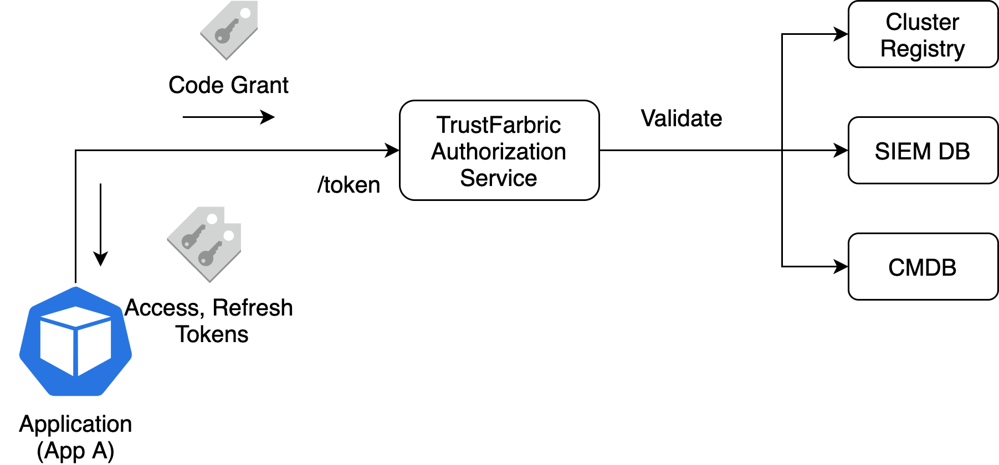

# Interactions and Interoperability
TrustFabric separates the interactions in two layer. First layer is *trusted underlay*, which is a fabric of trusted applications, while the second layer is *trusted overlay* which represents the session aspect of interactions initiated by users and apps via delegation of authorization.

Building Fabric of trusted applications (Underlay)
==================================================
Establishing a trusted fabric of applications (i.e. Underlay) is done in two steps, 
1. Establishing application identity and 
2. Establishing access patterns

The application identity is established by injecting code-grant via bootstrapping mechanism (bootstrap/referral token). Application can now use the code-grant to obtain the identity and access token using `token` endpoint of the authorization server.


Bootstrapping Application Identity
----------------------------------

TrustFabric is a password-less implementation, so applications do not have a static credential. 
Instead, applications obtain the access token via a referral token, issued by a trusted entity 
e.g. an authenticated admin user or by a trusted controller which has already established a 
TrustFabric based identity. Referral tokens are implemented using OAuth2 code grant and JWT 
representation. Specification extends the delivery model of Code grant, where code grant 
delegation can happen via:
1. Dev Ops user authorizing application using OAuth2 Authorization Code Grant Flow based 
delivery of code grant
1. Infrastructure controller using a back-channel mechanism to deliver code grant obtained, where 
infrastructure controller may have been authorized by Dev ops user defined in previous step

As part of referral identity injection, application deployment is provided with
a short duration referral identity token by TrustFabric, based on the trust declared
by a trusted referrer e.g. DevOps managing applications or a Kubernetes operator. The
referral token implements OAuth2 semantics of code-grant, where referrer token identity
is tied to referrer identity (using `sub` claim), while application identity is captured
using `aud` claim. The `aud` claim may contain multiple application identities ( this is 
non recommended as it weakens the security posture). The `aud` claim may contain the authorization
server identity as well , if the implementation of authorization server requires it.
This referral identity can later be used by application to obtain identity and access 
tokens. TrustFabric leverages OAuth2 to implement token request flows. *It is important 
to note that the token interaction produces access tokens with application's identity and 
not the tokens for delegated access*. Identity, subject and access claims embedded in the 
token are for the application. Unlike OIDC, there are no separate identity tokens. The 
access token is implemented as transparent token using JWT and can be used as application 
identity token (has identity claims embedded). The 
referral tokens are treated as code-grant issued by DevOps or by Operators. 
Code-grant delivery can be done via

-   OAuth2 code-grant flow

-   Back-channel i.e. Direct injection to application (e.g. Via secrets in Kubernetes)


### OAuth2 Authorization Code Flow


#### Authorization end-point
The authorization endpoint `/authorize` 
- Must support GET request with response_type=code as defined in [RFC 6749](https://tools.ietf.org/html/rfc6749)
- May support POST request
- MAY include an "application/x-www-form-urlencoded" encoded request attributes
- Must support fabric layer access token bases authorization for application initiated delegation


```http
GET /authorize?response_type=code&client_id=s6BhdRkqt3&state=xyz&redirect_uri=https%3A%2F%2Fclient%2Eacme%org%2Fcb HTTP/1.1
Host: authsrv.acme.org
```
Where:
-   `response_type` is OAuth2 required parameter and must be set to `code` to identify code-grant
-   `client_id` is URL encoded distinguished name of the client application e.g. `cn%3Dpass-1%2B%20L%3Dproduction%2C%20ou%3Dpaas%2C%20o%3Dcloud%2C%20dc%3Dapps%2C%20dc%3Dacme%2C%20dc%3Dorg`
-   `state` is implementation specific and left as a choice
-   `redirect_uri` is the pre-registered value of the redirect uri for the client. Value provided must match the configuration. More details will be added later. 

If the delegation is initiated by a application (e.g. infra controller), the controller must initiaute an authenticated request by providing the fabric access token as part of authorization header.

Response
```http
HTTP/1.1 302 Found
Location: https://client.acme.org/cb?code=SplxlOBeZQQYbYS6WxSbIA&state=xyz
```
Where:
- `code` is a JWT based code-grant define in [Tokens](./Tokens.md) section.

Error response must follow OAth2 code grant sematic defined in [RFC 6749](https://tools.ietf.org/html/rfc6749)


### Back Channel Controller

#### Back channel implementation for Kubernetes
All tokens in TrustFabric specification are short duration tokens, which
requires a mechanism to re-evaluate trust and replenish the referral
tokens to the application.

Once application receives the referral token (a.k.a. Code grant), it can
use the token flow to obtain access tokens with identity and
authorization claims.

1. Identity Controller
1. Admission Controller

Application Access Tokens
--------------------------------------
### Token Flow



Applications must initiate `token` flow using the referral tokens provided.

### Token Endpoint


Access Token Interoperability
-----------------------------
### Application Interaction


### OAuth2 and OIDC Interoperability

Building trusted session layer (Overlay)
========================================

OIDC Code Grant Flow
--------------------

### User based delegation

### Application based delegation

### Claims

Tokens Flow
-----------

### Token endpoint

#### Interactions

#### Capturing Delegation

#### Capturing Session Forwarding on Underlay


Integrations
============

HTTPS Integrations
--------------------

### Envoy Integration

### Istio Integration


GRPC Based Integration
-----------------------

SASL Integration
----------------
