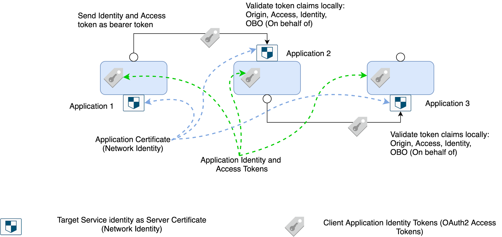
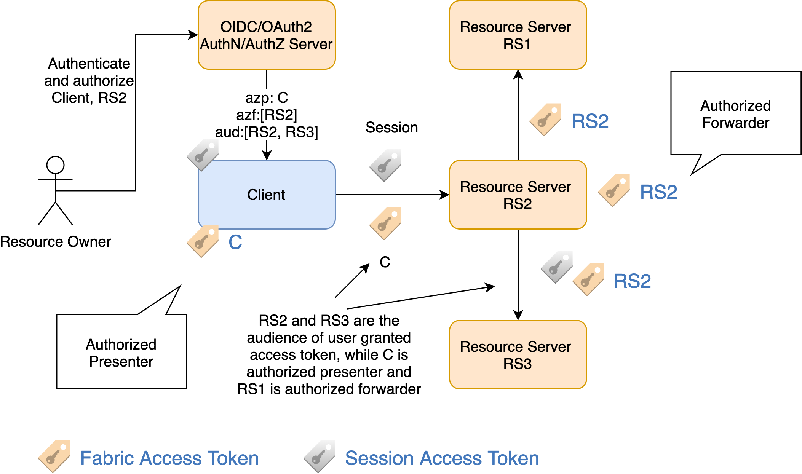
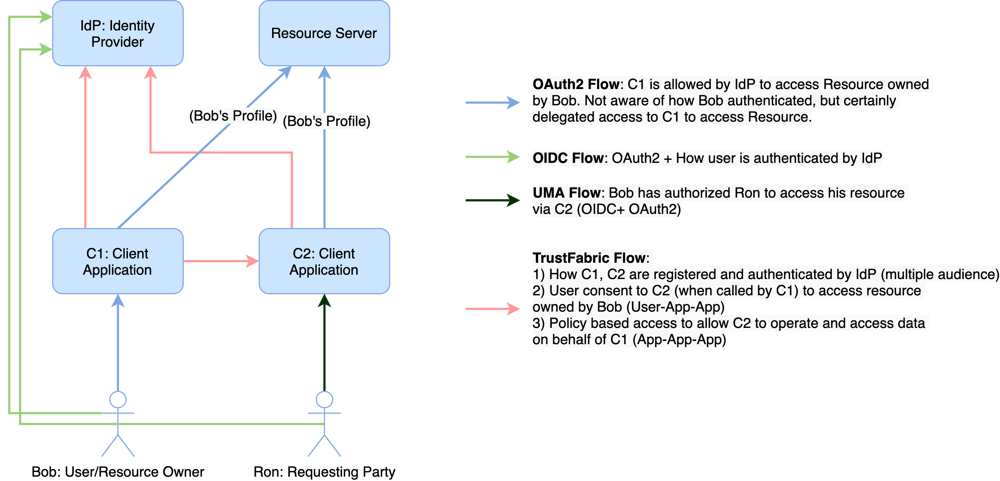

# TrustFabric : Cloud-Native Application Centric Identity and Access Management

Introduction
============

TrustFabric is an open-source specification for an application centric Cloud-Native Identity and Access management. It secures interactions between applications and between users and applications.

TrustFabric is an extension of OAuth2, OIDC specifications and also aligns with Kintara UMA 2.0 specifications. It establishes a strong application identity representation for handling the challenges associated with micro-services, e.g. compromised application identity and credentials, larger attack surface and [confused deputy](https://en.wikipedia.org/wiki/Confused_deputy_problem).

*Note*: Please read the [Terminology](./Terminology.md) section before proceeding.

Challenges and Goals
===================
Refer to [Goals](./Goals.md) section.

Overview
========
TrustFabric implements a layered approach for implementing security:
1. Application Fabric Layer
1. Session layer

## Application Fabric Layer
Fabric layer secures application (app-to-app) interactions. Fabric layer establishes a web of trusted and allowed transactions, where trust is evaluated continuously (zero-trust principle) and interaction are allowed based on access policies. This is achieved by providing a strong identity to each application which is self contained, non-repudiation and that provides protection against man-in-the-middle attack scenarios (impersonation). Source identity can be verified by the receiving application, locally. Verification includes identity, integrity, access claims, MitM and origin checks. Primary mechanism to establish application fabric layer is using TrustFabric JWT tokens, which leverages OAuth2 semantics. In some cases derived identities (X.509, Kerberos) are also supported (with limitations).

## Session Fabric Layer
Session layer requires Fabric layer to operate i.e. it assumes that the application identities are already established. Session layer is required when a user/operator session is needed and interactions are performed on-behalf-of users/operator by applications. Session layer allows the user/operator context to be passed as session information to resource services. TrustFabric leverages OpenID Connect (OIDC) specifications to implement session layer.

How TrustFabric works
---------------------
TrustFabric implementation includes:
* Application Identity representation using JWT based tokens. Tokens include application claims, Origin, Trust vectors and access claims. Application Identity represented as JWT can be used to:
    * Represent client identity and use to authenticate application client
    * Use token to obtain derived identities e.g. X.509 certificates, Kerberos tokens, SSH Certs/keys etc
* Interaction between applications is secured using TLS (Only TLS 1.2 or higher are supported).
* User identity is delegated to client application via OpenID Connect (OIDC) as a JWT based identity and access tokens
    * Client can use user access token to connect to resource services
    * Client must present client JWT tokens to identify itself and to present user token on behalf of user
* Access claims are embedded in the JWT token, this makes local validation of access possible
* All the tokens(including client tokens and user access tokens) are short duration tokens

Since interactions may be initiated by a user, a job or by an agent, TrustFabric build interoperability with OIDC/OAuth2 and allows delegation of authorization to application identities and thus allowing the interactions. The on-behalf-of and authorized presenter functionality helps in retaining the initiator context during app-to-app interactions.

### Fabric of trusted applications
TrustFabric relies on building a strong fabric for interactions between trusted application. The trusted fabric is (re)built continuously using:
1. Secured Communication: Encrypted communication using strict TLS 1.2+ compliance
1. Mutual Authentication
    1. Strong server identity represented using X.509 certificates with `Server Authentication` ( OID: `1.3.6.1.5.5.7.3.1` ). See [RFC 5280](https://tools.ietf.org/html/rfc5280) for details.
    1. Strong and verbose client identity using TrustFabric JWT tokens. This includes identity, origin, network and access verification (see [TrustFabric Tokens](./Tokens.md) and [Identities](./Identity.md) for more details).
1.  Policy based access which is locally verifiable. This is covered in details in [TrustFabric](./TrustFabric.md) and [Interoperability](./InterOp.md) sections.
    1. Claim based access controls (OAuth2/OIDC and extended scopes/claims)
    1. HTTP Authorization policies (CRUD and Endpoint policies)
1.  Identity bootstrapping
    1. Application Identity bootstrapping
    1. Using application identity to obtain Server X.509 certificates

This allows secure and trusted communication that is allowed based on policies and best-practices for securing interactions in both private and public network scenarios.   
*Note: Additional controls like application firewall, network ACL etc might have to be enabled based on security requirements, these controls will be covered by the specification in the future.*

### Managing Sessions End-to-End
Application interactions are more complex than simple app-to-app interactions. With micro-services there is increased attack surface and  complex interaction patterns e.g. user-to-app[-to-app]\+ and app-to-app[-to-app]\+ where source identity context might have to be propagated across multiple applications. E.g. a user context might have to be passed with verification capabilities across multiple micro-services to avoid confused deputy vulnerability. Without user context, the app-to-app interactions leads to a weaker access control model, where client application needs access to resources owned by all users, and may result in security vulnerabilities.
Specification achieves this by building interoperability and extending profiles for OIDC and OAuth2 specifications. The `azf` claim representing authorized forwarders is introduced. Details are covered in [Tokens](./Tokens.md) and [TrustFabric](./TrustFabric.md) sections.

Ecosystem: OIDC, OAuth2, UMA and TrustFabric
---------------------------------------

OAuth2 is the center of the universe in the TrustFabric specification. While OIDC and UMA extend the OAuth2 by providing specificity around authentication and user managed access aspects. TrustFabric extends the ecosystem for

- identity and authentication of applications (clients, resource services etc)
- Access and Authorization for app-to-app interactions
- Extends relying-party delegation to resource services as well, which allows user context to be forwarded across micro-services in a controlled and secure manner.
- Extending UMA2 User managed access model to be extended to applications/services and controllers, where an infrastructure pass service may grant an infrastructure operator/job an access to resources it owns (based on policy).

Diagram below compares OAuth2, OIDC, UMA2 and TrustFabric  

TrustFabric Components
------------------------------------

TrustFabric components are implemented as combination of federated and distributed control plane.

### Federated Control Plane Components

-   Federated Identity Stores (Application, Users, Groups, Zones)

-   Federated Policy Store (Admission, User-App, App-App,
    User-Resource,..)

-   Authentication and token services (OIDC, OAuth2, LDAP, KDC)

-   Key and Certificate Services/Agents

### Distributed Control Plane Components

-   Bootstrap Controllers (CodeGrant, X.509 Certs, Keytab files/KRB tokens)

-   Admission Webhooks

-   Application Specific Sidecars 
    -   Identity, access token refresh and delivery
    -   Verification of Caller Identity and Claims

Standards and Specifications
============================

1.  OAuth2.0 [[RFC 6749]](https://tools.ietf.org/html/rfc6749)
1.  Open ID Connect Specifications: [[OIDC]](https://openid.net/developers/specs/)
1.  JWT profile for OAuth2.0 [[RFC 7523]](https://tools.ietf.org/html/rfc7523)
1.  ITU [[X.509]](https://www.itu.int/rec/T-REC-X.509/en)
1.  SASL for OAuth [[RFC 7628]](https://tools.ietf.org/html/rfc7628)
1.  X.500/LDAP DN representation [[RFC 4514]](https://tools.ietf.org/html/rfc4514)
1.  SCIM - System for Cross-domain Identity Management: Core Schema [[RFC 7643]](https://tools.ietf.org/html/rfc7643)
1.  SCIM - System for Cross-domain Identity Management: Protocol [[RFC 7644]](https://tools.ietf.org/html/rfc7644)
1.  Representation and Verification of Domain-Based Application Service
    Identity within Internet Public Key Infrastructure Using X.509 (PKIX)
    Certificates in the Context of Transport Layer Security (TLS)[[RFC 6125]](https://tools.ietf.org/html/rfc6125)
1.  Service Mesh - Connect, secure, control and observe services [ISTIO](https://www.istio.io)
