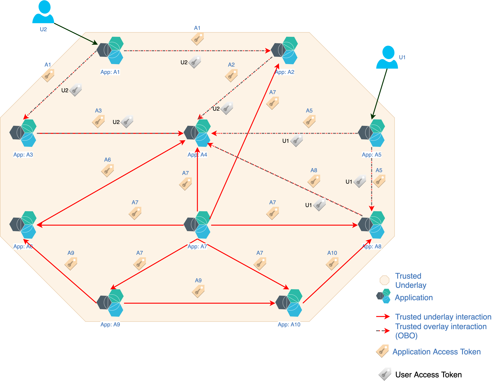

# Trusted Cloud-Native Application Fabric

TrustFabric implements layered approach for implementing secure fabric of application interactions. 

## Fabric Layer

Application identities are established first using the bootstrapping and token negotiation. Once identity is established, these identities are used to establish connectivity to allowed services over TLS based on policies. This establishes a secure underlay interaction pattern for applications. As new services interactions are added or removed access patterns will change.

### Goals

* Establish identities of all applications including bootstrapping and token negotiation
* Establish a *password-less* mechanism of application identity verification and validation
* Establish interactions based on application access policies and delegation (On-behalf-of) policies
* Secure the interaction using standard TLS based network connection. 
  * Server certificate carries the attested network identity
  * Client token carries the attested identity and access (interaction, delegation) policies

### Implementation

Fabric layer represents application identities using JWT based access token. The access token is presented by client for authentication to the server, while server presents a X.509 certificate as part of the TLS handshake to the client, which represents the server network identity. Specification supports following methods for application identity verification over network:

* HTTPS (Server Cert) + Authorization header (Bearer Token). This mechanism is most common for HTTP based applications for authentication and authorization.
* HTTPS (Server Cert) + Proxy-Authorization header (Bearer Token). This mechanism can be used in a mesh environment where applications use a proxy for ingress and egress connections inside mesh.
* SASL chaining based Overlay (TLS and JWT Bearer Token). This is based on [RFC 7628](https://tools.ietf.org/html/rfc7628).
* GRPC (Server Cert) + Bearer Token.

## Session Layer

Users interact with applications, and these applications may have to interact with other services on-behalf-of the user. These interactions help avoid a classic security concern with micro-services i.e. "Confused deputy". TrustFabric allows `azf` (authorized forwarder) claims and `azp` (authorized party) claims to allow relying-party(client) app and resource server apps to interact with other applications on-behalf-of the user.

### Goals

* Establish User Identity and User-Application delegation model
* Establish multi level delegation via authorized party (`azp`) and authorized forwarder (`azf`) claims
* Establish identification (headers, names etc) for underlay access token and overlay access tokens

### Implementation

* OIDC + OAuth2 for user identity and delegation
* Fabric-layer OAuth2 Access Tokens as client_secret for Overlay OIDC interactions

