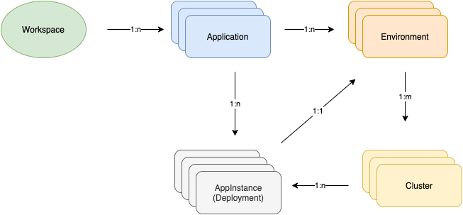

# Application Identities

Most significant aspect of TrustFabric specification is modeling of identities for Cloud Native Applications. Identity model plays a critical role in establishing a secure fabric for application interactions.

## Modelling Application Identity

Typically, business functions consist of multiple components e.g. Frontend Web/Mobile, Application APIs, databases, agents, jobs etc.  These components are maintained by different teams and typically are a  combination of multiple technologies (micro-services, stateful workloads  etc). Each of these components (a.k.a. applications) can have multiple  deployments (a.k.a. AppInstances) in different zones.

Application identity is represented as a JWT tokens, Kerberos tokens or X.509 certificates, where identity subject is represented using LDAP/X.509 Distinguished naming syntax. Application primary method of identification is a JWT token, while Kerberos and X.509 certificates are used to represent derived and network service identities.

## Application Model

Cloud Native Application Model is a highly flexible and easy to establish based on deployment environment. Model definition requires establishing a mapping for core entities that identify application.

### Entities

#### Workspace

Workspaces are business functions that provide trust boundaries for systems contained in it. Typically workspace is a collection of applications, services and systems implemented to support a business function. E.g. an e-commerce catalog is a business function that may have a web front-end application, services implementing catalog APIs and databases for persisting the entries.

#### Application

Application is typically an independent unit of execution that can be deployed and scaled. Application definition here includes web-applications, services, jobs, databases etc. In the e-commerce workspace above web-application, Services, databases are represented applications in this specification.

#### AppInstance

AppInstance (Application Instance) is the deployment of an application in a given environment with a specific version of code/binaries. It is a collection of environment, configuration and source code that is executing the desired function. Kubernetes deployment is an example of an AppInstance in a single cluster setup. In a multi-cluster setup, AppInstance is an federated object, across a given environment.

#### Environment

Every application goes through some kind of a development lifecycle process and thus gets deployed in different environments,  e.g. it is developed, tested before being deployed in a customer facing environment. Security policies typically try to restrict interactions based on environments. An `Application` can have multiple `environments` associated where it is deployed. An `AppInstance` will always be associated with an `environment`.

#### Cluster

Cluster is a group of compute nodes (VMs, Hosts) where AppInstances are deployed. In cloud native world, cluster will map to a Kubernetes cluster. Cluster identification is essential when there are multiple clusters for deploying AppInstances.

#### Entity Association

A workspace will have one or more applications. An application can have one or more AppInstances(deployments), each corresponding to a specific environment. Environment can be hosted using multiple clusters. AppInstance can reside in a cluster, but cluster can host multiple AppInstances.

Applications have characteristics which could include teams, source code/image, deployments, interactions etc., these characteristics can be used to identify and represent the application components. TrustFabric focuses on providing flexible mechanisms for representing applications using these characteristics. Application identity is implemented using JWT tokens and provides a consistent representation similar to user identities in OIDC/OAuth2 specification. Application can obtain and use derived identities e.g. Kerberos tokens or X.509 certificates  using TrustFabric identity. X.509 certificates are used to represent the server identity. X.50 certificates, Kerberos tokens and JWT tokens maintain one consistent subject representation model based on X.500 directory specifications for distinguished names.

## Application Subject Representation

TrustFabric uses the directory naming model based on distinguished names to represent application identity subject. Model is based on X.500 specification and LDAP DN RFC 4514 and RFC 2253. JWT subject (sub) claim, X.509 subject and Kerberos principal are represented using this naming. Few examples of identity subjects are shown below.

Key aspects to note:

1. Workspace is optional. If present must be unique under tenant domain
1. Application name must be unique under workspace. If workspace is missing, it should be unique for the tenant domain 
1. Tenant domain component will vary for each enterprise. Avoid using multiple tenant domains in your deployment as it provides a strict and less flexible isolation
1. Adding `dc=apps` and `dc=users` can be a good practice to isolate apps and users under tenant `dc=acme,dc=com`

## Representing Identities

Specification supports application identity representation in following systems:

1. [LDAP Directory](./LdapSchema.md)
2. [Kubernetes](./K8S.md)

